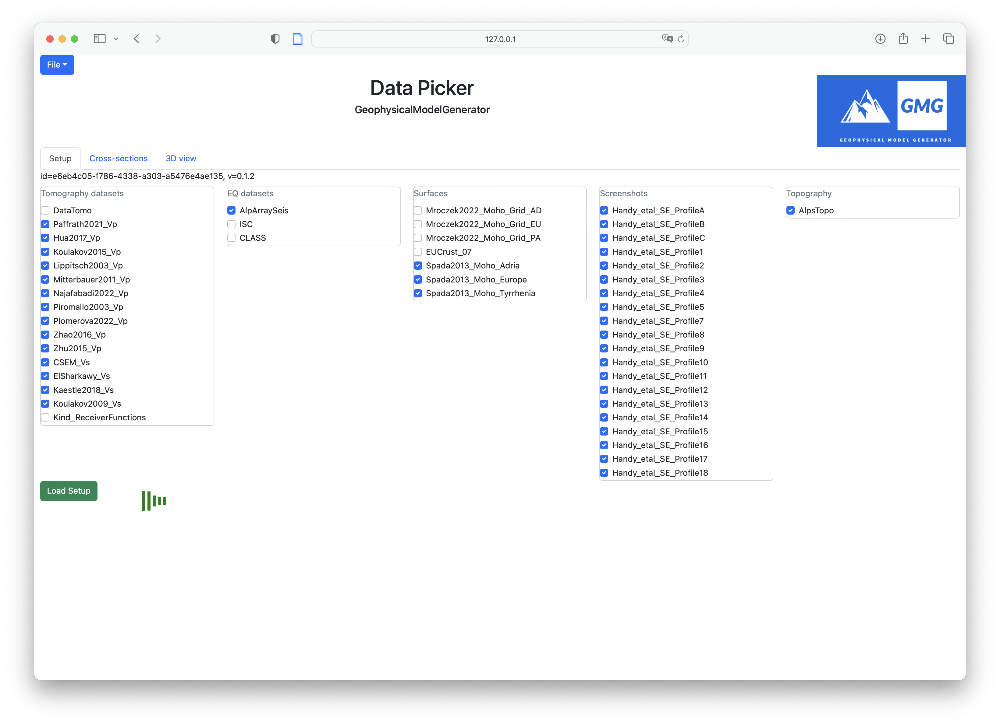
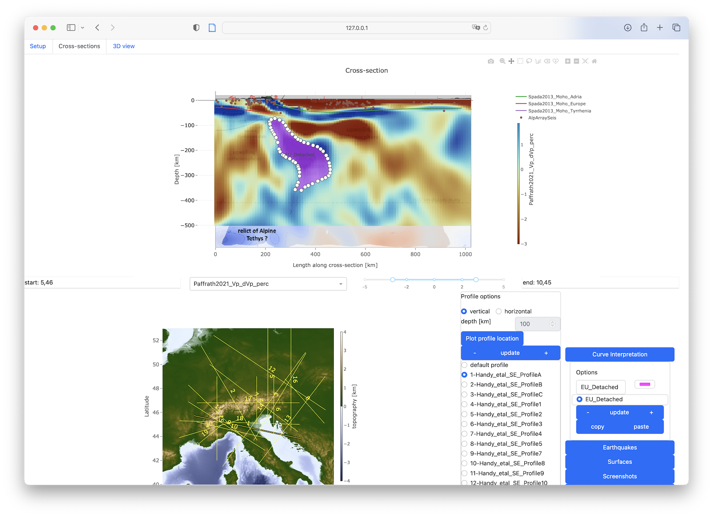
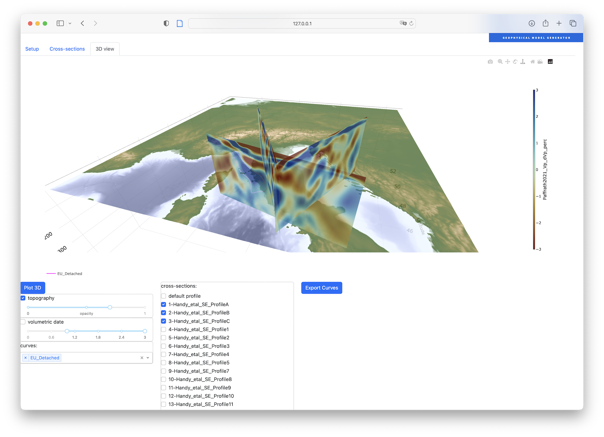

# GMG_DataPicker

Interpreting 3D geological and geophysical data in a consistent manner is non-straightforward. The [GeophysicalModelGenerator](https://github.com/JuliaGeodynamics/GeophysicalModelGenerator.jl) package provides a number of useful tools to combine and visualize datasets. 
`GMG_DataPicker` is a web-based graphical user interface build on top of GMG, which allows creating interactive interpretations from such data.

The main features are:
- Import volumetric data (e.g., seismic tomography), surfaces (e.g., Moho depth), points (e.g., earthquake), topography or screenshots from published papers from remote or local locations.
- Switch easily between different datasets (e.g., different tomography models).
- Interactively add your interpretation to profiles through the datasets (e.g. top of the European or Appenninic slabs).
- Visualize your interpretations in 3D.

## 1. Getting started

#### Install
Start with opening julia (version >1.9)
```julia
julia> using Pkg
julia> Pkg.add(url="https://github.com/JuliaGeodynamics/DataPicker")
julia> Pkg.instantiate()
```

### Start the GUI
```julia
julia> using DataPicker
julia> GMG_TomoData()
[ Info: Listening on: 127.0.0.1:8050, thread id: 1
```
Now you can open the address `127.0.0.1:8050` in your favorite webbrowser (e.g., Safari), which should look something like:


Hit the green buton, and the data will be loaded. Next, you can switch to the Cross-sections tab and start interpreting profiles.
After a while, this could look like:



And finally, you can look at the data in 3D:


